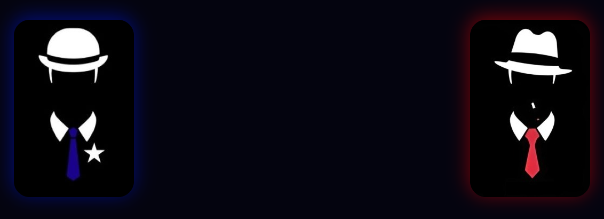

# Guerras Civis

  

Desenvolvido para a disciplina de Paradigmas de Linguagens de Programação - Universidade Federal de Campina Grande.

## Descrição
Guerras Civis é um jogo de estratégia e blefe onde duas equipes, a máfia e os civis, lutam pela sobrevivência. Composto por 12 jogadores, 6 para cada equipe. Cada jogador é sorteado para uma equipe e recebe uma função.

## Funções
### Mafiosos:
- Assassino:
    - Ação: Escolhe um jogador para matar.
    - Conhecimento: Sabe quem é o Aprendiz e o Silenciador.
- Aprendiz: 
   - Ação: Após o Assassino ser morto, assume o seu papel. 
   - Conhecimento: Sabe quem é o Assassino e o Silenciador.
 
- Paparazzi: 
   - Ação: Escolhe um jogador para revelar, durante o dia, a sua função para todos. 
   - Conhecimento: Não sabe a identidade de ninguém.
 
- Paralisador: 
   - Ação: Escolhe um jogador para paralisar, não podendo executar sua ação naquela rodada. 
   - Conhecimento: Não sabe a identidade de ninguém.

- Silenciador: 
   - Ação: Escolhe jogador para silenciar, impedindo-a de executar sua ação na noite, de votar de dia e se comunicar com outros jogadores. 
   - Conhecimento: Sabe quem é o Assassino e o Aprendiz.

- Bruxo:
   - Ação: Escolhe uma palavra para ser a "cursed_word". Quem digitar essa palavra é morto. 
   - Conhecimento: Não sabe a identidade de ninguém.
 
### Civis: 
- Detetive:
  - Ação: Escolhe um jogador para investigar, descobrindo a sua função.
  - Conhecimento: Inicialmente, não se sabe a identidade de ninguém.

- Juiz: 
  - Ação: Pode executar, a qualquer momento, um jogador. O juiz pode executar mesmo silenciado. 
  - Conhecimento: Sabe apenas quem é o médico.

- Policial: 
  - Ação: Recebe passivamente informação sobre o jogador que executou alguma ação sobre ele. Caso o juiz for morto antes de executar alguém, o policial poderá executar em seu lugar.
  - Conhecimento: Sabe quem é o Juiz.

- Médico: 
  - Ação: Imuniza um jogador de ser alvo de ações.
  - Conhecimento: Não sabe a identidade de ninguém.

- Aldeão: 
  - Ação: Seu voto vale por 3 na votação do dia.
  - Conhecimento: Não sabe a identidade de ninguém.

- Espírito Vingativo:
  - Ação: Ao ser morto, escolhe uma pessoa para morrer junto dele.
  - Conhecimento: Não sabe a identidade de ninguém.

## Como Jogar?
Uma partida possui 5 rodadas, cada uma tendo um dia e uma noite. A primeira rodada é iniciada à noite. É durante a noite que grande parte das ações são executadas. 
Os acontecimentos da noite são noticiados no dia. Após isso, é aberta a votação, em que todos os jogadores discutem e votam anonimamente para matar um jogador. Após a votação, passa-se a rodada e começa a próxima noite.

Através da comunicação por chat de texto, os jogadores tecem suas estratégias, arquitetam seus blefes e coordenam suas ações. Vence a equipe que eliminar todos os jogadores da equipe adversária ou possuir mais jogadores vivos após a 5° rodada. 

### Ferramentas
- Haskell
- Prolog
- PostgreSQL
- React
